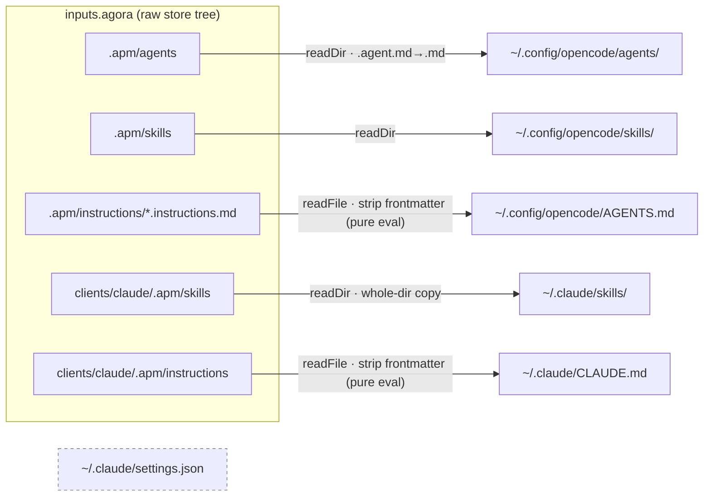

# Agora integration

This document explains how `opencode.nix` and `claude.nix` consume
[`agora`](https://github.com/vansweej/agora)'s content, and how that
relates to the parallel path colleagues use (`apm install`). For agora's
own rationale — why OpenCode gets its content verbatim while Claude gets an
LLM-rendered tree — see agora's own
[`docs/architecture.md`](https://github.com/vansweej/agora/blob/main/docs/architecture.md).

## Two consumers of one source, not two sources

Agora migrated to [apm](https://github.com/microsoft/apm) (Agent Package
Manager) packaging, structuring its content as `.apm/agents/`,
`.apm/skills/`, and `.apm/instructions/` primitives. That structure has two
independent readers:

- **This repo** reads agora's raw git tree directly, via `inputs.agora` +
  `builtins.readDir` — no build, no apm CLI, no per-system derivation for
  the file content itself.
- **`apm install`** reads the same tree's `apm.yml` + `.apm/` layout and
  deploys it to a colleague's machine.

Neither path is a fork of the other, and neither is downstream of the
other — they are two readers of one committed source. Home Manager stays
what it has always been: **pure configuration management**, wiring
agora's content into the right place on Jan's own machines. It does not
gain any new "package producer" responsibilities from this migration.

## What changed in `opencode.nix` / `claude.nix`

Agora's restructure moved content into apm-native paths and renamed agent
files (apm's `agents` primitive convention is `<name>.agent.md`). Both
modules were updated to match:

- **`opencode.nix`** — `agentEntries` now reads `.apm/agents/` instead of
  `agents/`, and strips the `.agent.md` suffix back down to `.md` on
  deploy (OpenCode itself expects a plain `<name>.md`). `skillEntries`
  reads `.apm/skills/`. The separate `nativeSkillEntries` block (which used
  to fold in `clients/opencode/native/context-audit` as an extra readDir)
  is **gone** — apm has no concept of a client-native skill subdirectory,
  so agora folded `context-audit` into the same `.apm/skills/` namespace
  during its migration, and it is now discovered by the ordinary
  `skillEntries` readDir like any other skill.
- **`claude.nix`** — the two separate readDirs
  (`clients/claude/generated/skills/` for rendered content,
  `clients/claude/native/` for hand-authored skills) collapsed into a
  single `skillEntries` reading `clients/claude/.apm/skills/`, for the same
  reason: agora merged generated and native skills into one directory once
  packaging the whole tree for apm.

## Frontmatter stripping

Agora's `AGENTS.md` and `CLAUDE.md` are now authored as apm **instruction
primitives** — `.apm/instructions/agents.instructions.md` and
`clients/claude/.apm/instructions/claude.instructions.md` — so that
`apm compile` can fold them into a colleague's `AGENTS.md` / `CLAUDE.md`.
That requires a small YAML frontmatter block (`description:`) at the top
of each file, which neither OpenCode's nor Claude Code's own instruction
reader expects or wants.

Both modules define a `stripFrontmatter` helper: a **pure, `builtins`-only**
string transform (`builtins.readFile` + `lib.splitString`/`lib.lists.drop`)
that removes a leading `---`-delimited block before the content is written
via `home.file."...".text`. There is deliberately **no derivation** here —
no `runCommand`, no build step — because introducing one would require an
extra builder for that single file, which would regress the property that
lets `oryp6`'s x86_64-linux config evaluate on a darwin host without a
cross-builder. Pure Nix evaluation has no such requirement; only real
derivations (`pkgs.runCommand`, etc.) do.

## The `settings.json` invariant, unchanged

`~/.claude/settings.json` was never declared by `claude.nix` before this
migration, and nothing about the migration changes that. It remains
corporate Bedrock configuration (`AWS_PROFILE`,
`ANTHROPIC_DEFAULT_*_MODEL` inference-profile ARNs, OTEL endpoints)
provisioned by the separate `~/.aits-claude-code-setup` tool. Home Manager
only manages files it explicitly declares in `home.file`, so simply never
declaring `settings.json` is sufficient to leave it untouched — the same
guarantee applies identically to a colleague's `apm install`, since the
Claude apm package ships zero hooks (the one primitive type that would
otherwise cause apm to write into `settings.json`).
