# Architecture

This repository uses a layered module composition model so that multiple machines
can be managed from a single flake without conditionals scattered across shared
files.

## Repository layout

```
flake.nix                          # mkHome helper; all homeConfigurations outputs
machines/
  oryp6.nix                        # Plain attrset: system, username, homeDir, flags
  m1.nix                           # Plain attrset: system, username, homeDir, flags
  m5.nix                           # Plain attrset: system, username, homeDir, flags
modules/
  common.nix                       # Universal config — all machines; imports opencode.nix
  opencode.nix                     # OpenCode config — auto-discovery, activation, session vars
  linux.nix                        # Linux-only config
  darwin.nix                       # macOS-only config
  machines/
    oryp6.nix                      # oryp6-specific config
    m1.nix                         # M1-specific config
    m5.nix                         # M5-specific config
opencode/                          # OpenCode files deployed to ~/.config/opencode/
  agents/                          # Agent .md files (auto-discovered)
  skills/                          # Skill subdirectories, each with SKILL.md (auto-discovered)
  commands/                        # Command .md files (auto-discovered)
  tools/                           # Tool implementations (auto-discovered; shell out to ai-coding at runtime)
  bin/                             # CLI wrapper scripts (auto-discovered; deployed to ~/.local/bin/)
nvim/                              # Neovim plugin files (live-symlinked)
```

## Module layers

Each machine profile is composed from exactly three layers:

```
modules/common.nix          ← all machines (imports opencode.nix)
      +
modules/linux.nix           ← x86_64-linux machines only
  OR
modules/darwin.nix          ← aarch64-darwin machines only
      +
modules/machines/<name>.nix ← that machine only
```

`opencode.nix` is imported by `common.nix` and handles all OpenCode-specific
configuration: auto-discovered agents, skills, commands, and tools; session
variables; and session path.

## Machine metadata files

Each machine has a **plain Nix attrset** file under `machines/`:

```nix
# machines/oryp6.nix
{
  system = "x86_64-linux";
  username = "vansweej";
  homeDirectory = "/home/vansweej";
  stateVersion = "25.11";
  cudaSupport = true;
}
```

This file is imported by `flake.nix` *before* `pkgs` is instantiated — it is not
a home-manager module. This avoids the chicken-and-egg problem where `system` must
be known to create `pkgs`, but `pkgs` must exist before modules are evaluated.

## The `mkHome` helper

`flake.nix` defines a `mkHome` function that wires everything together:

```nix
mkHome = machineMetaPath: machineModulePath:
  let
    meta = import machineMetaPath;           # 1. read plain attrset
    isDarwin = builtins.match ".*-darwin" meta.system != null;

    pkgs = import nixpkgs {
      system = meta.system;                  # 2. correct architecture
      config.allowUnfree = true;
      config.cudaSupport = meta.cudaSupport; # 3. per-machine CUDA flag
      overlays = if isDarwin then []         # 4. nixGL on Linux only
                 else [ nixgl.overlay ];
    };
  in
  home-manager.lib.homeManagerConfiguration {
    inherit pkgs;
    extraSpecialArgs = { inherit inputs meta; };
    modules = [
      { home.username = meta.username;       # 5. identity from metadata
        home.homeDirectory = meta.homeDirectory;
        home.stateVersion = meta.stateVersion; }
      ./modules/common.nix                   # 6. universal
    ]
    ++ (if isDarwin then [ ./modules/darwin.nix ]
                    else [ ./modules/linux.nix ]) # 7. platform
    ++ [ machineModulePath ];                # 8. machine-specific
  };
```

Key properties:

- **No hardcoded identity in any module** — `home.username`, `home.homeDirectory`,
  and `home.stateVersion` are always injected from the metadata file.
- **Per-machine `pkgs`** — each configuration gets its own nixpkgs instantiation
  with the correct `system` and `cudaSupport`. There is no shared global `pkgs`.
- **Conditional overlays** — `nixgl.overlay` is only applied on Linux. Applying it
  on Darwin would cause evaluation errors since nixGL is Linux-specific.
- **`systemd` never evaluated on Darwin** — the Docker systemd service lives
  exclusively in `modules/machines/oryp6.nix`, which is never imported by any
  Darwin configuration.

## Activation script ordering

Two activation scripts run on every `home-manager switch`:

| Script | Module | Order | Purpose |
|---|---|---|---|
| `bootstrapNvim` | `common.nix` | Before `writeBoundary` | Bootstraps `~/.config/nvim` from LazyVim starter |
| `installOpencodeTools` | `opencode.nix` | After `writeBoundary` | Copies agora's `tools/*.ts` into `~/.config/opencode/tools/` as real files |

`bootstrapNvim` runs **before** `writeBoundary` — the phase where home-manager
creates `mkOutOfStoreSymlink` symlinks — so nvim symlinks are never dangling on a
fresh machine's first activation.

`installOpencodeTools` runs after `writeBoundary` and `cp`s each tool from the
pinned `agora` flake input into `~/.config/opencode/tools/` as a genuine
writable file (not a symlink — see the `mkOutOfStoreSymlink` vs store paths
section below for why), removing any previously-copied tool whose source no
longer exists in agora. It is idempotent and cheap (plain text file copies).

OpenCode's `@opencode-ai/plugin` dependency (needed by those tools) is not
installed by any home-manager activation script: OpenCode auto-installs it
into `~/.config/opencode/node_modules` itself on first launch (see its own
`config/config.ts`), so no home-manager-side `bun install` step or
lockfile-hash stamp is needed.

The ai-coding monorepo itself is a Nix package — `node_modules` are baked into the
Nix store at build time via a two-phase derivation (FOD cache fetch + pure offline
install). No clone or `bun install` is needed at activation time.

## `mkOutOfStoreSymlink` vs store paths vs real-file copy

Three kinds of file management are used:

| Method | When used | Behaviour |
|---|---|---|
| Store path (`.source = ./path`) | Static files: skills, agents, commands, bin wrappers, `opencode.json` | Symlinked into Nix store; requires `home-manager switch` to update |
| `mkOutOfStoreSymlink` | Live files: nvim plugins | Symlinked to the repo path; updates immediately on disk |
| Activation-script real-file copy | OpenCode tools | Plain file, not a symlink; requires `home-manager switch` to update |

OpenCode tools (`pipeline.ts`, `skill-retrieval.ts`, `codebase-retrieval.ts`) are
deployed as **real files**, copied by the `installOpencodeTools` activation
script from the pinned `agora` flake input into `~/.config/opencode/tools/` —
deliberately **not** a symlink of any kind (neither a plain store symlink nor
`mkOutOfStoreSymlink`). Bun (like Node) resolves symlinks to their realpath
before doing `node_modules` resolution for a file's own imports; a tool file
that is a symlink into the read-only Nix store therefore fails to resolve
`@opencode-ai/plugin` (no `node_modules` exists in the store). Only a real
file living directly under `~/.config/opencode/tools/` resolves correctly, by
walking up to `~/.config/opencode/node_modules` (which OpenCode installs
itself). `home.file` cannot express a non-symlinked destination — every entry
becomes a symlink, directly or via an intermediate `home-manager-files`
derivation — which is why tools use a dedicated activation script instead.

The tools are full implementations that delegate to the ai-coding monorepo at
runtime via subprocess (`bun run <script> --cwd $AI_CODING_MONOREPO`) rather
than importing code from it. Editing a tool now requires a commit to `agora`
+ `nix flake update agora` + `home-manager switch`, same as agents/skills —
not a live edit.

See [`docs/pipeline-tool.md`](./pipeline-tool.md) for details on the pipeline tool's
invocation surfaces, execution flow, and exit-code handling.

## `opencode.json` config flow

`opencode.json` is the single source of truth for base OpenCode permissions. It
lives in the `ai-coding` repo and flows through the Nix build into each machine.
Three machines (oryp6, M5, M1) now override it — folding the athenaeum-mcp,
cerebrum-mcp, and choragos overlays (from the shared `modules/athenaeum.nix`,
`modules/cerebrum.nix`, and `modules/choragos.nix`) into a single
`lib.recursiveUpdate` chain, with permissions always inherited from upstream. M5
additionally folds its Ollama provider into the same merge. Parallels (and
parallels-ubuntu) inherits the upstream file unchanged.

```mermaid
graph LR
    AIC["ai-coding/opencode.json<br/>source of truth<br/>model · compaction · permissions"]
    NS["Nix store<br/>aiCodingPkg"]
    ON["opencode.nix<br/>home.file source"]
    AE["modules/athenaeum.nix<br/>opencodeOverlay"]
    CE["modules/cerebrum.nix<br/>opencodeOverlay"]
    CH["modules/choragos.nix<br/>opencodeOverlay + defaultProfile"]

    AIC -->|nix build| NS
    NS -->|builtins.readFile\nbuiltins.fromJSON| ON

    ON -->|"lib.mkForce\n+ athenaeum + cerebrum + choragos overlays"| OR["oryp6"]
    ON -->|"lib.mkForce\n+ athenaeum + cerebrum + choragos overlays"| M1["M1"]
    ON -->|"lib.mkForce\n+ Ollama provider<br/>+ athenaeum + cerebrum + choragos overlays"| M5["M5"]
    ON -->|"inherits as-is"| PP["parallels"]
    ON -->|"inherits as-is"| PU["parallels-ubuntu"]

    AE -.->|config.programs.*| OR
    AE -.->|config.programs.*| M1
    AE -.->|config.programs.*| M5

    CE -.->|config.programs.*| OR
    CE -.->|config.programs.*| M1
    CE -.->|config.programs.*| M5

    CH -.->|config.programs.*| OR
    CH -.->|config.programs.*| M1
    CH -.->|config.programs.*| M5
```



To update permissions for all machines: edit `opencode.json` in `ai-coding`,
push, then run `nix flake update ai-coding` in this repo and `home-manager switch`.

## Flake inputs

| Input | Source | Notes |
|---|---|---|
| `nixpkgs` | `github:nixos/nixpkgs/nixos-unstable` | `allowUnfree = true`; `cudaSupport` per machine |
| `home-manager` | `github:nix-community/home-manager` | Follows `nixpkgs` |
| `nixgl` | `github:guibou/nixGL` | Overlay applied on Linux only; never on Darwin |
| `ai-coding` | `github:vansweej/ai-coding` | Follows `nixpkgs`. Two-phase Nix derivation: FOD cache + pure `bun install`; `node_modules` baked in. Exports the pipeline/orchestrator monorepo consumed via `AI_CODING_MONOREPO` |
| `athenaeum` | `github:vansweej/athenaeum-mcp` | Follows `nixpkgs`. Store-built `athenaeum-mcp-server` binary; registered as an MCP server on oryp6/M1/M5 |
| `cerebrum` | `github:vansweej/cerebrum-mcp` | Follows `nixpkgs`. Store-built `cerebrum` binary; registered as an MCP server on oryp6/M1/M5 |
| `choragos` | `github:vansweej/choragos` | Follows `nixpkgs`. Store-built `choragos-mcp-server` binary + `choragos` CLI; provides the `choragos_run_plan` plan-cycle orchestrator |
| `agora` | `github:vansweej/agora` | Follows `nixpkgs`. Raw source tree for OpenCode agents/skills/commands/tools/bin + Claude Code config; consumed directly (no per-system build) |

The `ai-coding` input exports `packages.${system}.default` — the full source tree
with `node_modules` pre-installed offline. `opencode.nix` resolves the store path
via `inputs.ai-coding.packages.${meta.system}.default` and sets it as
`AI_CODING_MONOREPO`. Updating ai-coding: `nix flake update ai-coding` + commit
`flake.lock` + `home-manager switch`.

## Adding a new machine

See [adding-a-machine.md](adding-a-machine.md) for the step-by-step guide.
