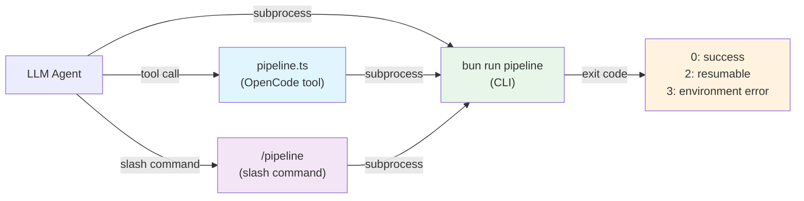
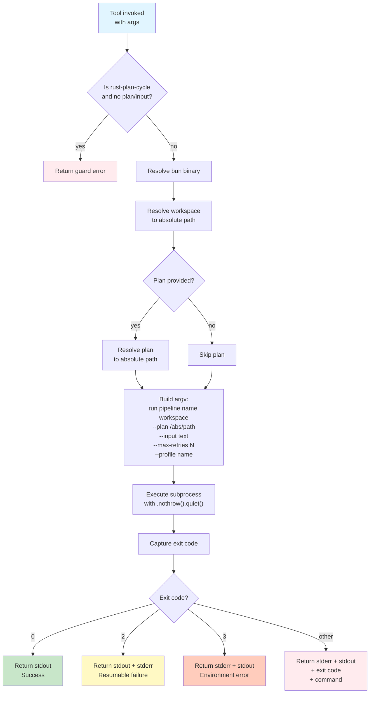

# Pipeline Tool

The `pipeline` tool exposes the ai-coding monorepo's pipeline orchestrator to OpenCode agents. It allows LLMs to scaffold new projects, run full development cycles, or execute pre-written plans without leaving the agent context.

## Overview

Pipelines are multi-phase workflows that combine planning, implementation, testing, and coverage analysis. The tool shells out to `bun run pipeline` in the monorepo and returns structured output for the LLM to summarize and act on.

### Supported Pipelines

| Pipeline | Use case | Phases |
|---|---|---|
| `scaffold-rust` | Bootstrap a new Rust project | cargo init → generate flake.nix |
| `scaffold-cpp` | Bootstrap a new C++ project | generate CMakeLists.txt → src/main.cpp → flake.nix |
| `dev-cycle` | Full TypeScript development cycle | plan → implement → test |
| `rust-dev-cycle` | Full Rust development cycle | plan → implement → fmt → clippy → test → coverage |
| `cmake-dev-cycle` | Full C++ development cycle | plan → implement → configure → build → ctest |
| `rust-plan-cycle` | Execute a pre-written Rust plan | plan → implement → fmt → clippy → test → coverage |

## Invocation Surfaces

The pipeline tool is accessible via three surfaces:



### Tool (OpenCode)

```typescript
pipeline(
  name: "rust-plan-cycle",
  workspace: "/path/to/project",
  plan: "./plan.md",
  maxRetries: 3,
  profile: "local"
)
```

### Slash Command

```
/pipeline rust-plan-cycle /path/to/project --plan ./plan.md --max-retries 3 --profile local
```

### CLI (direct)

```bash
bun run --cwd $AI_CODING_MONOREPO pipeline rust-plan-cycle /path/to/project \
  --plan ./plan.md --max-retries 3 --profile local
```

## Execution Flow

The tool follows this sequence when invoked:



## Exit Codes and Handling

The CLI returns standardized exit codes that the tool interprets:

| Exit Code | Meaning | Tool Response | User Action |
|---|---|---|---|
| `0` | Success | Returns stdout (pipeline output) | Review results; pipeline is complete |
| `2` | Resumable failure | Returns stdout + stderr with "resumable failure" message | Run the pipeline again to resume from the failed phase |
| `3` | Environment/input error | Returns stderr + stdout with "environment error" message | Check workspace, branch, plan file, or input; fix and retry |
| Other | Unexpected error | Returns stderr + stdout + exit code + command | Investigate the error; may require debugging |

### Exit Code 2: Resumable Failure

Occurs when a phase fails its verification gate (e.g., coverage threshold not met, clippy warnings, test failure). The pipeline state is saved, allowing the LLM to fix the issue and resume:

```
Pipeline encountered a resumable failure (exit code 2).
You can run the pipeline again to resume from where it stopped.

Details:
[phase output and error details]
```

### Exit Code 3: Environment/Input Error

Occurs when the environment is misconfigured or input is invalid (e.g., running on a protected branch, plan file not found, invalid workspace). These are not resumable:

```
Pipeline encountered an environment or input error (exit code 3).
Check the workspace, branch, or plan file and try again.

Details:
[error details]
```

## rust-plan-cycle Specifics

`rust-plan-cycle` is the only pipeline that accepts a pre-written plan file. It differs from `rust-dev-cycle` in that it skips the planning phase and executes a provided plan directly.

### Arguments

- **`plan`** (optional): Path to a plan file (e.g., `./plan.md`). Resolved to an absolute path before passing to the CLI. If provided, the pipeline executes this plan.
- **`input`** (optional): Request text describing the task. If provided instead of a plan, the pipeline generates a plan first.
- **`maxRetries`** (optional): Maximum number of times to retry resumable failures (exit code 2). Defaults to the CLI default if unset.
- **`profile`** (optional): Model profile to use (`local`, `copilot-default`, or `hybrid`). Defaults to `copilot-default` if unset. Can be overridden by the `AI_CODING_MODEL_PROFILE` environment variable.

### Guard

The tool enforces that `rust-plan-cycle` must have either a plan file or input text:

```
Error: rust-plan-cycle requires either a plan file (--plan) or input text (--input).
Provide at least one.
```

### Plan File Format

Plan files follow the Conventional Commits structure with phases and steps:

```markdown
# Feature: <feature name>

## Phase N: <phase title>

Commit message: <conventional commit message>

### Step N: <step title>

<implementation instruction>
```

Each phase is one commit's worth of work. Steps are executed in order within a phase.

### Example Invocation

```typescript
// Execute a pre-written plan with local model
pipeline(
  name: "rust-plan-cycle",
  workspace: "/path/to/my-project",
  plan: "./plan.md",
  profile: "local"
)
```

```typescript
// Generate a plan from input and execute it
pipeline(
  name: "rust-plan-cycle",
  workspace: "/path/to/my-project",
  input: "Add error handling to the parser"
)
```

## Implementation Details

### Path Resolution

The tool resolves relative paths to absolute paths before passing them to the CLI:

```typescript
const absolutePlan = resolve(args.plan);  // Relative → absolute
argv.push("--plan", absolutePlan);
```

This ensures the CLI can find the plan file regardless of the current working directory.

### Profile Handling

The tool does **not** default the profile argument. If unset, the CLI uses its own default (`copilot-default`) and respects the `AI_CODING_MODEL_PROFILE` environment variable:

```typescript
if (args.profile) {
  argv.push("--profile", args.profile);
}
// If args.profile is undefined, the flag is not added.
// The CLI and environment override remain effective.
```

### Exit Code Capture

The tool uses `.nothrow().quiet()` to capture the exit code without throwing:

```typescript
const proc = await Bun.$`${bunBin} ${argv}`.cwd(monorepoRoot).nothrow().quiet();
const exitCode = proc.exitCode;
```

This allows the tool to inspect the exit code and return a user-friendly message rather than propagating an exception.

## Deployment

The tool is deployed as an out-of-store symlink to `~/Projects/home-manager/opencode/tools/pipeline.ts` via `mkOutOfStoreSymlink` in `modules/opencode.nix`. This allows bun to resolve `node_modules` relative to the file.

**Live updates:** Edits to the tool file are picked up immediately without `home-manager switch`. However, schema changes require reloading OpenCode so the new args are recognized.

## Related Documentation

- **Architecture:** See [`docs/architecture.md`](./architecture.md) for details on tool deployment and the out-of-store symlink pattern.
- **Monorepo:** The pipeline CLI is defined in the `ai-coding` repository (`github:vansweej/ai-coding`).
- **Plan Format:** See the `plan` skill in OpenCode for guidance on writing multi-phase plans.
